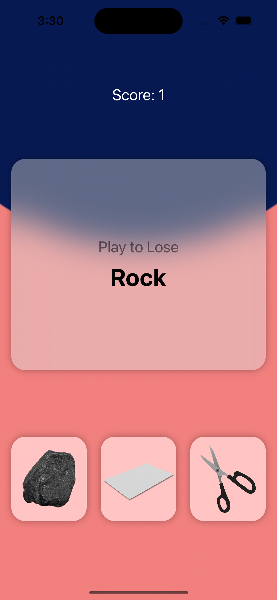

## Rock Paper Scissors Pro

Welcome to the Rock-Paper-Scissors game – a classic hand game implemented in SwiftUI!

### Screenshtos

### How to Play

1. Clone the repository to your local machine.
2. Open the project using Xcode or any SwiftUI-compatible IDE.
3. Build and run the app on a simulator or a physical device.

### Gameplay

The objective is simple: beat the computer by making the right moves! The game is set for a maximum of 10 moves. You will be presented with the computer's move, and you have to choose whether you want to **Win** or **Lose** against it. Select your move by tapping on the corresponding button – **Rock**, **Paper**, or **Scissors**.

### Scoring

- If you choose the move that beats the computer's move, you gain a point.
- If you choose the move that loses to the computer's move, you lose a point.
- In case of a tie, neither player gains or loses a point.

### Keep an Eye on the Clock!

With only 10 moves allowed, you'll need to make strategic choices to maximize your score. Think fast, but think wisely!

### Contribute

Found a bug? Want to add more features? Contributions are always welcome! Feel free to open issues, submit pull requests, and make this game even better.

### Have Fun!

Enjoy the classic RockPaperScissors game and test your wits against the computer. May the odds be in your favor! 😄👊🤚
